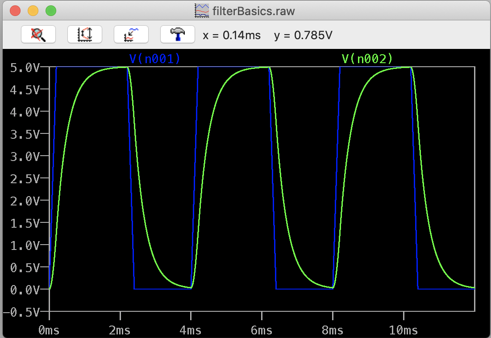
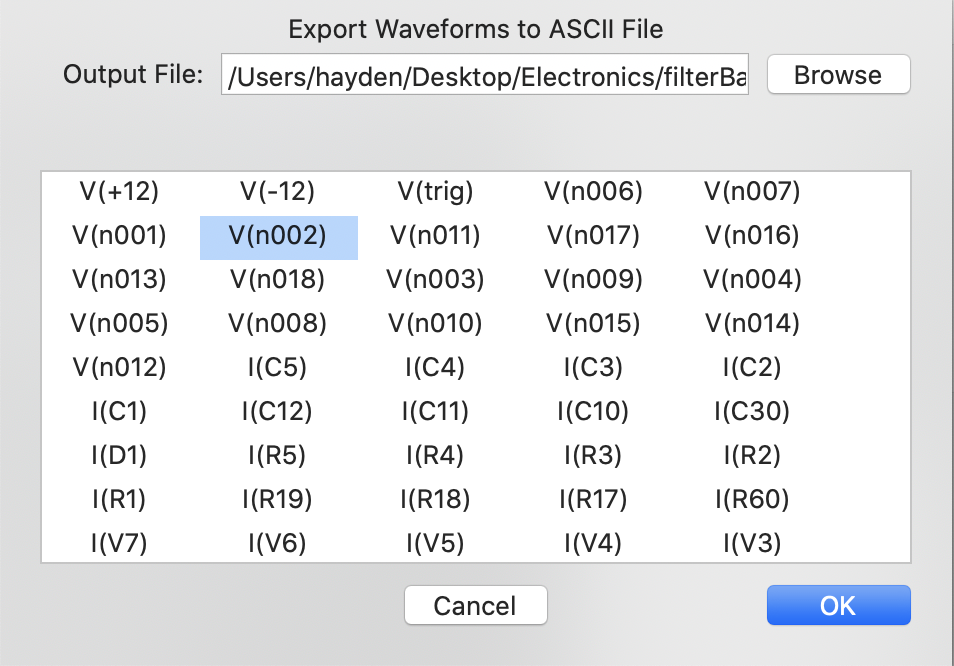
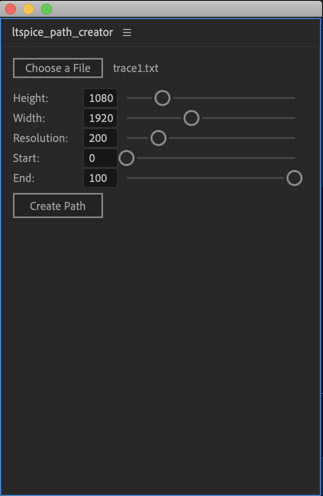

# After Effects LTSpice Path Creator

An After Effects ScriptUI panel that allows data from LTSpice circuit simulations to be displayed as shape paths

## Installation

To install, just drag the 'LTSpiceToPath.jsx' file into the 'Script UI Panels' folder inside your After Effects installation

## Exporting from LTSpice

LTSpice comes with a tool to export data from its simulations as a text file. From the graphing window, click the hammer icon and then click on 'Data Export Tool'
on the Waveforms tab.

In the data export dialog, just select the signal you want to graph. **_NOTE: Each signal must be exported in its own text file._**

## Controls

The panel has controls for the path's width and height as well as resolution. The Start and End controls dictate
the beginning and end of the path as percentages of the data's total duration.

## Changelog

### Sep 29 2024

- Added color picker for path stroke
- Added stroke width control
- Fixed issue with signal getting inverted when its range was entirely negative
